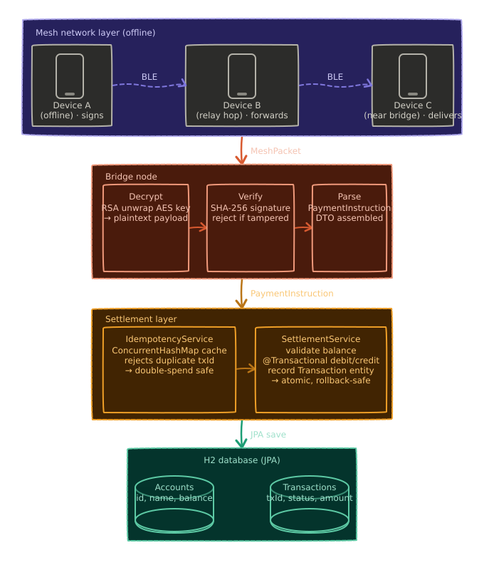

<div align="center">

# 📡 HopPay

### Offline UPI Payments over Bluetooth Mesh

[](#-getting-started)
[](https://spring.io/projects/spring-boot)
[](https://openjdk.org)
[](LICENSE)

**HopPay** is a proof-of-concept payment engine that enables UPI-style transactions with **zero internet connectivity** — payments are created offline on virtual devices, cryptographically signed, relayed hop-by-hop across a simulated Bluetooth mesh, and settled by a secure bridge node.

</div>

---

## ✨ Features

- **Offline payment creation** — virtual devices generate and sign payment packets with no internet connection required
- **Bluetooth mesh simulation** — packets hop between `VirtualDevice` nodes mimicking real BLE relay behavior
- **Hybrid cryptography** — payloads encrypted with AES-256; AES keys secured with RSA-2048; each packet signed with SHA-256withRSA to prevent tampering
- **Idempotent settlement** — duplicate `txId`s are detected and rejected via a `ConcurrentHashMap` cache, preventing double-spends even under concurrent load
- **Atomic transactions** — balance debits and credits are wrapped in `@Transactional` boundaries, ensuring consistency on failure
- **Live dashboard** — Thymeleaf-powered UI at `/dashboard` showing real-time transaction volume and a rolling table of settlements
- **Scheduled traffic simulation** — a `@Scheduled` task continuously generates synthetic mesh traffic so the dashboard stays live
- **Zero frontend dependencies** — pure Thymeleaf + HTML, no JS framework

---

## 🏗️ Architecture



### How a payment travels

```
Device creates PaymentInstruction (offline)
      ↓
AES-256 encrypts payload → RSA-2048 wraps the AES key → SHA-256 signs the packet
      ↓
MeshPacket hops between VirtualDevices (simulated BLE)

## How to Run

### Prerequisites

- JDK 17+ installed

### Start the app (Windows)

```cmd
mvnw.cmd spring-boot:run
```

### Start the app (Mac/Linux)

```bash
./mvnw spring-boot:run
```

Then open: http://localhost:8080/dashboard

## Architecture (High-Level)

1. A sender device creates a payment instruction and encrypts it.
2. The packet hops through nearby devices (mesh gossip).
3. A bridge device with internet uploads the packet to the backend.
4. The backend decrypts, validates, deduplicates, and settles.

## Features

- Hybrid encryption (AES + RSA) to protect payment payloads.
- Signature verification to reject tampered packets.
- Idempotent settlement to prevent double spends.
- A live dashboard showing metrics and the latest transactions.
      ↓
Bridge receives packet → decrypts → verifies signature
      ↓
IdempotencyService checks txId → rejects duplicates
      ↓
SettlementService validates balance → debits sender → credits receiver
      ↓
Transaction recorded → Dashboard updated
```
## 📁 Project Structure

src/
└── main/
    ├── java/com/demo/hoppay/
    │   ├── HopPayApplication.java              # Entry point (@SpringBootApplication, @EnableScheduling)
    │   ├── config/
    │   │   └── AppConfig.java                  # Bean configuration
    │   ├── controller/
    │   │   ├── ApiController.java              # REST endpoints (/api/ingest, /api/status/{txId})
    │   │   └── DashboardController.java        # Dashboard view (/dashboard)
    │   ├── crypto/
    │   │   ├── ServerKeyHolder.java            # Bridge RSA keypair management
    │   │   └── HybridCryptoService.java        # AES + RSA encryption/decryption & signing
    │   ├── model/
    │   │   ├── Account.java                    # JPA entity: accountId, name, balance
    │   │   ├── Transaction.java                # JPA entity: txId, sender, receiver, amount, status, timestamp
    │   │   ├── PaymentInstruction.java         # DTO: decrypted payment payload
    │   │   └── MeshPacket.java                 # DTO: encrypted packet with hopCount, ttl, signature
    │   ├── repository/
    │   │   ├── AccountRepository.java          # JpaRepository<Account, Long>
    │   ├── service/
    │   │   ├── IdempotencyService.java         # txId deduplication
    │   │   ├── SettlementService.java          # Balance validation, debit/credit, recording
    │   │   ├── BridgeIngestionService.java     # Packet decryption, verification, routing
    │   │   ├── MeshSimulatorService.java       # Virtual device registry & BLE hop simulation
    │   │   └── DemoService.java                # Seed data + scheduled traffic generation
    │   └── mesh/
    │       └── VirtualDevice.java              # Simulated mobile device with offline queues & keys
    └── resources/
        ├── application.properties
        └── templates/
            └── dashboard.html                  # Thymeleaf live dashboard
```

---

## 🚀 Getting Started

### Prerequisites

- Java 17+
- Maven 3.8+

### Installation

```bash
# Clone the repository
git clone https://github.com/YOUR_USERNAME/hoppay.git
cd hoppay

# Build
./mvnw clean install

# Run
./mvnw spring-boot:run
```

Open [http://localhost:8080/dashboard](http://localhost:8080/dashboard) in your browser.

### H2 Console (optional)

```
http://localhost:8080/h2-console
JDBC URL: jdbc:h2:mem:hoppay
```

---

## 🔐 Security Design

### Hybrid Encryption Flow

| Step | Side | Action |
|---|---|---|
| 1 | Device | Generate random AES-256 key |
| 2 | Device | Encrypt `PaymentInstruction` JSON with AES key |
| 3 | Device | Encrypt AES key with Bridge's RSA-2048 public key |
| 4 | Device | Sign `(ciphertext + metadata)` with Device's RSA private key |
| 5 | Device | Assemble `MeshPacket` and queue for mesh relay |
| 6 | Bridge | Decrypt AES key using Bridge's RSA private key |
| 7 | Bridge | Decrypt ciphertext using AES key |
| 8 | Bridge | Verify packet signature — reject if invalid |
| 9 | Bridge | Forward `PaymentInstruction` to `SettlementService` |

### Double-Spend Protection

Each payment carries a globally unique `txId`. `IdempotencyService` maintains a `ConcurrentHashMap<String, Boolean>` — any packet whose `txId` has already been processed is immediately rejected, even under concurrent ingestion from multiple bridge threads.

Correctness is verified by `IdempotencyConcurrencyTest`, which fires multiple threads at the same `txId` simultaneously and asserts exactly one settlement succeeds.

---

## 🌐 REST API

### Ingest a Mesh Packet

```
POST /api/ingest
Content-Type: application/json

{
  "hopCount": 3,
  "ttl": 10,
  "signature": "<base64-signature>",
  "encryptedPayload": "<base64-aes-ciphertext>",
  "encryptedAesKey": "<base64-rsa-wrapped-key>"
}
```

### Check Transaction Status

```
GET /api/status/{txId}
```

Returns the current status — `PENDING`, `SUCCESS`, or `FAILED` — for the given transaction ID.

---

## ⚙️ Tech Stack

| Layer | Technology |
|---|---|
| Framework | Spring Boot 3.x |
| Persistence | Spring Data JPA + H2 (in-memory) |
| Templating | Thymeleaf |
| Cryptography | Java JCA — AES-256, RSA-2048, SHA256withRSA |
| Build Tool | Maven |
| Language | Java 17+ |

---

## 🔭 Future Scope

- Replace H2 with PostgreSQL for persistence across restarts
- Integrate actual BLE libraries (Android `BluetoothLeScanner`) for real device communication
- Add UPI VPA (Virtual Payment Address) resolution layer
- Propagate end-to-end settlement acknowledgments back through the mesh to the originating device
- Per-device rate limiting and fraud scoring at the bridge ingestion layer


<div align="center">

Built with ☕ and Spring Boot &nbsp;·&nbsp; No internet required

</div>